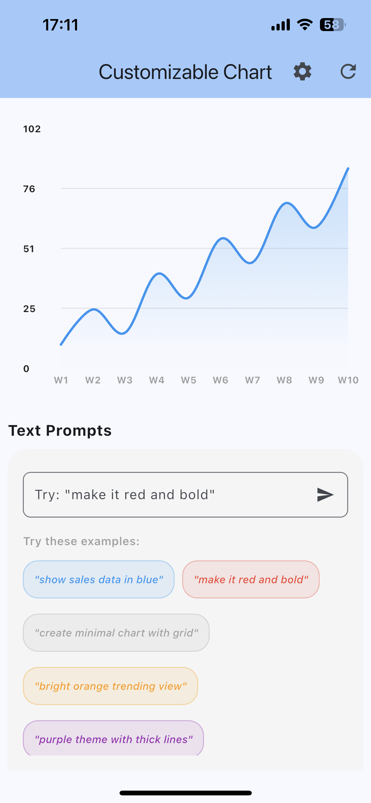
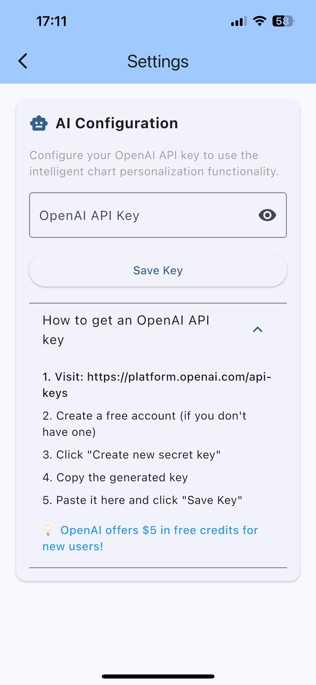
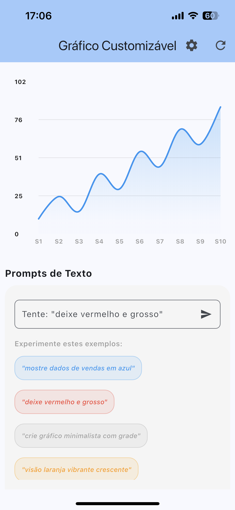
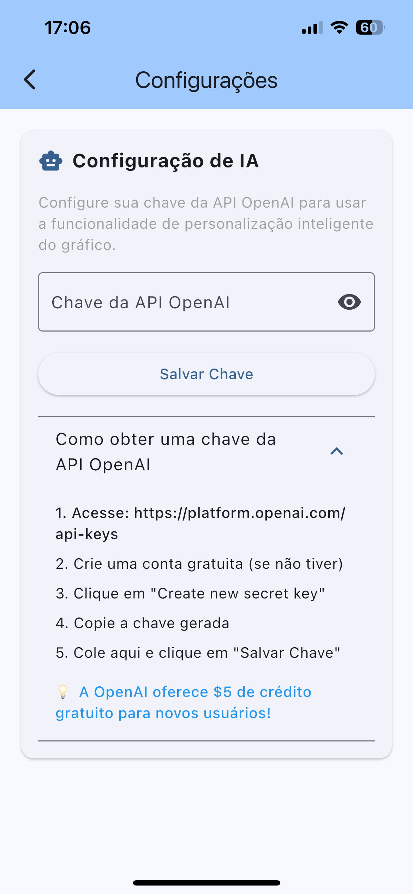

# Customizable Chart Flutter App

<div align="center">

<p align="center">
  <a href="#english">🇺🇸 English</a> •
  <a href="#português">🇧🇷 Português</a>
</p>

---

## English

A Flutter application that allows chart customization through natural language text prompts, supporting both intelligent AI processing and predefined commands.

</div>

### ✨ Key Features

- 📊 **Interactive Line Chart** - Customizable chart with smooth animations
- 🎨 **Real-time Styling** - Change colors, thickness, and visual properties instantly
- 💬 **Natural Language Processing** - Control charts using intuitive text commands
- 🤖 **AI Integration** - Advanced prompt processing with OpenAI API
- 🌐 **Bilingual Support** - Complete localization in English and Portuguese
- ⚙️ **Smart Settings** - Easy API key management with secure storage
- 📱 **Responsive Design** - Modern UI that works on all screen sizes

### 📱 App Preview

#### English Interface
<div align="center">


</div>

### 🚀 Quick Start

1. **Clone the repository**
   ```bash
   git clone https://github.com/yourusername/customizable_chart.git
   cd customizable_chart
   ```

2. **Install dependencies**
   ```bash
   flutter pub get
   ```

3. **Run the app**
   ```bash
   flutter run
   ```

### 🎯 Usage Examples

#### Built-in Commands
Try these preset prompts for immediate results:
- `"make it red and bold"` - Creates a bold red line chart
- `"show sales data in blue"` - Generates blue-themed sales visualization
- `"create minimal chart with grid"` - Minimalist design with grid lines
- `"bright orange trending view"` - Dynamic orange trending visualization
- `"purple theme with thick lines"` - Purple styling with enhanced line thickness

#### AI-Powered Commands (with API key)
With OpenAI API configured, use more complex natural language:
- `"Change the chart to green with a gradient background"`
- `"Make the line thicker and add more data points"`
- `"Create a professional blue theme for presentation"`
- `"Use warm colors with elegant styling"`

> 💡 **Free Trial Available!** You can try AI commands up to **3 times** without configuring an API key. After that, you'll need to add your own OpenAI API key to continue using AI features.

### ⚙️ AI Configuration

To unlock unlimited AI features:

1. **Get your OpenAI API Key**
   - Visit [OpenAI API Keys](https://platform.openai.com/api-keys)
   - Create a new API key
   - Copy the generated key

2. **Configure in the app**
   - Open the Settings page (⚙️ icon)
   - Enter your API key in the "OpenAI API Key" field
   - Tap "Save Key"

3. **Start using AI commands**
   - The app will automatically use AI for complex prompts
   - Without API key: 3 free AI attempts, then fallback to built-in commands
   - With API key: Unlimited AI usage

### 🏗️ Architecture

```
lib/
├── main.dart                          # Application entry point
├── injector.dart                      # Dependency injection setup  
├── model/
│   ├── models/
│   │   └── chart_data_model.dart     # Chart data model
│   ├── repositories/
│   │   └── llm_repository.dart       # AI service integration
│   └── services/                     # Core services
├── view/
│   ├── chart_page.dart              # Main chart page
│   ├── settings_page.dart           # Settings configuration
│   └── components/                  # Reusable UI components
├── viewmodel/                       # State management
└── l10n/                           # Internationalization files
    ├── app_en.arb                  # English translations
    └── app_pt.arb                  # Portuguese translations
```

### 🌐 Internationalization (i18n)

The app features complete bilingual support:

- **ARB Files**: Translation strings stored in Application Resource Bundle format
- **Automatic Locale Detection**: App automatically detects device language
- **Runtime Language Switching**: Users can switch between English and Portuguese
- **Contextual Translations**: All UI elements, prompts, and messages are localized
- **Fallback Support**: Graceful fallback to English if translation is missing

### 🧪 Testing

The project includes comprehensive unit tests covering:

- **Model Tests**: Chart data model validation and transformations
- **ViewModel Tests**: Business logic and state management
- **Repository Tests**: AI integration and prompt processing
- **Service Tests**: Core functionality and error handling

Run tests with:
```bash
flutter test
```

### 🛠️ Built With

---

## Português

Um aplicativo Flutter que permite a personalização de gráficos por meio de prompts de texto em linguagem natural, suportando tanto o processamento inteligente de IA quanto comandos predefinidos.

### ✨ Principais Recursos

- 📊 **Gráfico de Linhas Interativo** - Gráfico personalizável com animações suaves
- 🎨 **Estilo em Tempo Real** - Altere cores, espessura e propriedades visuais instantaneamente
- 💬 **Processamento de Linguagem Natural** - Controle os gráficos usando comandos de texto intuitivos
- 🤖 **Integração com IA** - Processamento avançado de prompts com a API OpenAI
- 🌐 **Suporte Bilíngue** - Localização completa em inglês e português
- ⚙️ **Configurações Inteligentes** - Gerenciamento fácil da chave da API com armazenamento seguro
- 📱 **Design Responsivo** - UI moderna que funciona em todos os tamanhos de tela

### 📱 Prévia do App

#### Interface em Português
<div align="center">


</div>

### 🚀 Início Rápido

1. **Clone o repositório**
   ```bash
   git clone https://github.com/yourusername/customizable_chart.git
   cd customizable_chart
   ```

2. **Instale as dependências**
   ```bash
   flutter pub get
   ```

3. **Execute o app**
   ```bash
   flutter run
   ```

### 🎯 Exemplos de Uso

#### Comandos Predefinidos
Experimente estes prompts predefinidos para resultados imediatos:
- `"torne-o vermelho e negrito"` - Cria um gráfico de linhas vermelhas e em negrito
- `"mostre os dados de vendas em azul"` - Gera uma visualização de vendas com tema azul
- `"crie um gráfico minimalista com grade"` - Design minimalista com linhas de grade
- `"visualização de tendência em laranja brilhante"` - Visualização de tendência dinâmica em laranja
- `"tema roxo com linhas grossas"` - Estilo roxo com espessura de linha aumentada

#### Comandos Potencializados por IA (com chave da API)
Com a API OpenAI configurada, use linguagem natural mais complexa:
- `"Altere o gráfico para verde com um fundo gradiente"`
- `"Aumente a espessura da linha e adicione mais pontos de dados"`
- `"Crie um tema azul profissional para apresentação"`
- `"Use cores quentes com estilo elegante"`

> 💡 **Teste Grátis Disponível!** Você pode experimentar comandos de IA até **3 vezes** sem configurar uma chave da API. Depois disso, será necessário adicionar sua própria chave da API OpenAI para continuar usando os recursos de IA.

### ⚙️ Configuração da IA

Para desbloquear recursos ilimitados de IA:

1. **Obtenha sua Chave da API OpenAI**
   - Visite [Chaves da API OpenAI](https://platform.openai.com/api-keys)
   - Crie uma nova chave da API
   - Copie a chave gerada

2. **Configure no app**
   - Abra a página de Configurações (ícone ⚙️)
   - Insira sua chave da API no campo "Chave da API OpenAI"
   - Toque em "Salvar Chave"

3. **Comece a usar comandos de IA**
   - O app usará automaticamente a IA para prompts complexos
   - Sem chave da API: 3 tentativas gratuitas de IA, depois volta para comandos predefinidos
   - Com chave da API: Uso ilimitado de IA

### 🏗️ Arquitetura

```
lib/
├── main.dart                          # Ponto de entrada da aplicação
├── injector.dart                      # Configuração de injeção de dependência
├── model/
│   ├── models/
│   │   └── chart_data_model.dart     # Modelo de dados do gráfico
│   ├── repositories/
│   │   └── llm_repository.dart       # Integração com serviço de IA
│   └── services/                     # Serviços principais
├── view/
│   ├── chart_page.dart              # Página principal do gráfico
│   ├── settings_page.dart           # Configurações
│   └── components/                  # Componentes de UI reutilizáveis
├── viewmodel/                       # Gerenciamento de estado
└── l10n/                           # Arquivos de internacionalização
    ├── app_en.arb                  # Traduções em inglês
    └── app_pt.arb                  # Traduções em português
```

### 🌐 Internacionalização (i18n)

O app possui suporte bilíngue completo:

- **Arquivos ARB**: Strings de tradução armazenadas em formato Application Resource Bundle
- **Detecção Automática de Idioma**: App detecta automaticamente o idioma do dispositivo
- **Troca de Idioma em Tempo Real**: Usuários podem alternar entre inglês e português
- **Traduções Contextuais**: Todos os elementos da UI, prompts e mensagens são localizados
- **Suporte a Fallback**: Fallback gracioso para inglês se a tradução estiver ausente

### 🧪 Testes

O projeto inclui testes unitários abrangentes cobrindo:

- **Testes de Modelo**: Validação e transformações do modelo de dados do gráfico
- **Testes de ViewModel**: Lógica de negócio e gerenciamento de estado
- **Testes de Repository**: Integração com IA e processamento de prompts
- **Testes de Serviços**: Funcionalidade principal e tratamento de erros

Execute os testes com:
```bash
flutter test
```

### 🛠️ Construído Com